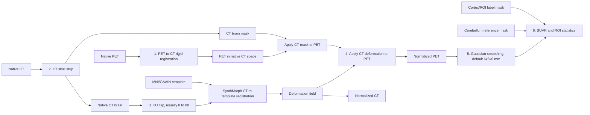

# SynCT

SynCT 是一个 3D Slicer scripted module，用于 PET/CT 预处理、CT 辅助的 PET 空间标准化、SUVR 生成和 ROI 定量分析。核心思想是先把 PET 刚性配准到同一受试者的 CT，再用 CT 估计到模板空间的形变场，最后把同一个空间变换施加到 PET 上，从而得到标准空间 PET。

## 工作流程



## 安装

1. 克隆或下载本仓库：

   ```bash
   git clone https://github.com/yanyan-7/SynCT.git
   ```

2. 打开 3D Slicer，进入 `Edit > Application Settings > Modules`。

3. 在 `Additional module paths` 中添加本仓库目录，也就是包含 `SynCT.py` 的目录。

4. 重启 3D Slicer。

5. 在模块列表中找到 `PET Quantification > SynCT`。

SynCT 调用的 Slicer CLI 包括 `BRAINSFit`、`BRAINSResample` 和 `SwissSkullStripper`。如果运行头骨剥离时报 `Required Slicer module is not available: swissskullstripper`，请在 3D Slicer 的 Extension Manager 中安装或启用 SwissSkullStripper 相关扩展，然后重启 Slicer。

### Python 依赖

普通 DICOM 转换、高斯平滑、SUVR 和表格输出建议在 Slicer Python 中安装：

```python
slicer.util.pip_install("dicom2nifti pydicom nibabel scipy openpyxl")
```

SynthMorph 需要 TensorFlow、surfa、voxelmorph、neurite 等依赖。推荐在 Windows 上使用仓库自带的 WSL GPU 后端，详细步骤见：

```text
mri_synthmorph/WSL_GPU_SETUP.md
```

如果只想用 Slicer Python 后端，也需要把 `mri_synthmorph/requirements.txt` 中的依赖安装到 Slicer Python 环境中。由于 TensorFlow 与 Slicer Python 版本兼容性可能随系统不同而变化，GPU 工作流更推荐使用 WSL。

## SynthMorph 模型文件

本仓库不包含 SynthMorph 的大模型权重文件。用户需要从 SynthMorph 官方网站下载模型文件，并放到下面目录：

```text
mri_synthmorph/synthmorph/
```

需要的文件名必须保持不变：

```text
mri_synthmorph/synthmorph/synthmorph.affine.2.h5
mri_synthmorph/synthmorph/synthmorph.deform.3.h5
```

下载入口：

- SynthMorph 官方网站：https://synthmorph.io
- SynthMorph/FreeSurfer Docker 页面：https://hub.docker.com/r/freesurfer/synthmorph

不同注册模式需要的权重如下：

| 模式 | 所需模型 |
| --- | --- |
| `joint` | `synthmorph.affine.2.h5` 和 `synthmorph.deform.3.h5` |
| `affine` | `synthmorph.affine.2.h5` |
| `rigid` | `synthmorph.affine.2.h5` |
| `deform` | `synthmorph.deform.3.h5` |

如果模型未放到正确位置，运行时会提示 `model weights not found`。

## 推荐数据准备

如果已经有 NIfTI 文件，可以直接在 3D Slicer 中用 `File > Add Data` 载入 CT、PET、模板和 mask，然后跳过 DICOM import。

如果使用 `GAAIN AV45 SUVR` 一键流程，推荐每个受试者一个目录，至少包含：

```text
Subject001/
  CT.nii
  AV45_PET.nii
```

模板图像需要用户自行提供，例如 MNI152 或项目使用的 GAAIN 模板。仓库内已提供部分 Atlas/mask，可作为默认参考：

```text
Atlas/Abeta_ctx_meta_roi_2mm/voi_CerebGry_2mm.nii
Atlas/Abeta_ctx_meta_roi_2mm/voi_ctx_2mm.nii
```

为减少 WSL 路径和编码问题，建议数据和输出目录使用英文路径。

## 模块使用说明

### 1. DICOM import

用于把 CT/PET DICOM 序列转换为 NIfTI 并载入 Slicer。

1. `CT DICOM dir`：选择 CT DICOM 文件夹。
2. `PET DICOM dir`：选择 PET DICOM 文件夹。
3. `Output dir`：选择 NIfTI 输出目录。
4. `CT output name` 和 `PET output name`：设置输出文件名。
5. PET 如果需要从 DICOM 剂量信息转换为 SUV，勾选 `Convert PET to SUV using DICOM dose metadata`。
6. 点击 `Convert CT` 或 `Convert PET`。

PET 转 SUV 需要 DICOM 中包含注射剂量、半衰期、注射时间、采集时间和体重信息；如果缺失，请先在外部完成 SUV 转换，再以 NIfTI 导入。

### 2. Preprocess

#### CT skull strip

1. `Skull strip input`：选择 native CT。
2. `Brain output`：默认 `brain`。
3. `Mask output`：默认 `brain_mask`。
4. 点击 `Run skull strip`。

输出包括去骨后的 CT 和脑 mask。该 mask 后续可用于限制 PET 只保留脑内信号。

#### CT clip

1. `CT clip input`：选择 CT 或 skull-stripped CT。
2. `Clip minimum` / `Clip maximum`：设置 HU 截断范围。
3. `Normalize clipped CT to 0-1`：需要归一化时勾选。
4. `CT clip output`：设置输出名。
5. 可选填写 `Optional save path` 保存为 NIfTI。
6. 点击 `Clip CT`。

在 CT 辅助 PET 标准化主流程中，推荐对去骨 CT 使用 HU `[0, 80]`，与界面中的 `GAAIN AV45 SUVR` 自动流程一致。

#### Apply mask to PET

1. `PET volume`：选择已经配准到 CT 空间的 PET。
2. `Mask volume`：选择 CT brain mask。
3. `Masked PET output`：设置输出名。
4. 可选填写 `Optional save path`。
5. 点击 `Apply mask to PET`。

如果 mask 与 PET 几何不一致，SynCT 会先用 nearest-neighbor 重采样 mask。

### 3. Registration

#### PET-to-CT rigid registration

1. `Fixed/reference`：选择 native CT。
2. `Moving/input`：选择 native PET。
3. `Registered output`：例如 `PET_rigid_to_CT`。
4. `Transform output`：例如 `PET_to_CT_rigid_transform`。
5. `Interpolation`：PET 推荐 `BSpline` 或 `Linear`；label map 使用 `NearestNeighbor`。
6. `Sampling fraction`：默认 `0.01`，图像差异较大时可适当增大。
7. 点击 `Run rigid registration`。

输出是配准到 CT 空间的 PET 和刚性变换节点。

#### Apply transform

用于把已有 Slicer transform 施加到其他体数据。

1. `Apply input volume`：待变换图像。
2. `Transform`：Slicer transform 节点。
3. `Reference volume`：输出空间参考图像。
4. `Apply output`：输出名。
5. `Apply interpolation`：PET/CT 用 `BSpline` 或 `Linear`，mask 用 `NearestNeighbor`。
6. 点击 `Apply transform`。

#### SynthMorph registration

用于估计 moving 图像到 fixed/template 图像的 affine、deform 或 joint 变换。

1. `SynthMorph moving`：选择待标准化图像，主流程中通常是 HU `[0, 80]` 的 skull-stripped CT。
2. `SynthMorph fixed`：选择模板图像。
3. `SynthMorph output`：保存标准空间 CT。
4. 勾选 `Save deformation/transform field` 并设置 `SynthMorph transform`。
5. `SynthMorph mode`：推荐 `joint`；也可选择 `affine`、`rigid`、`deform`。
6. `SynthMorph backend`：推荐 `WSL GPU`；也可使用 `Slicer Python`。
7. WSL 后端填写 `WSL distro`、`WSL Python` 和 `CUDA_VISIBLE_DEVICES`。
8. 点击 `Check SynthMorph backend`，确认 TensorFlow 和 GPU 可见。
9. 点击 `Run SynthMorph`。

#### Apply SynthMorph transform

用于把 CT-to-template 的形变场施加到 PET。

1. `SynthMorph apply transform`：选择 SynthMorph 生成的 `.nii/.nii.gz/.mgz/.lta` 变换文件。
2. `SynthMorph apply input`：选择 PET，例如 masked PET in native CT space。
3. `SynthMorph apply output`：设置标准空间 PET 输出路径。
4. `SynthMorph interpolation`：PET 推荐 `bspline`；mask 使用 `nearest`。
5. 点击 `Apply SynthMorph transform`。

### 4. PET quantification

#### Create SUVR image

1. `PET/SUV input`：选择 PET 或 SUV 图像。
2. `Smooth PET before SUVR`：默认勾选。该步骤应在标准空间 PET 上执行，并且位于参考脑区强度归一化之前。
3. `Smoothing FWHM X/Y/Z`：设置高斯平滑核，单位为 mm，默认 `6 x 6 x 6 mm`。
4. `Smoothed PET output`：设置平滑后 PET 的节点名；可选填写 `Optional smoothed PET save path` 保存 NIfTI。
5. `Reference mask`：选择参考区 mask，例如 cerebellum GM。
6. `SUVR output`：设置输出名。
7. 可选填写 `Optional save path`。
8. 点击 `Create SUVR image`。

平滑后的 PET 会作为 SUVR 计算输入。SUVR 计算方式为：

```text
SUVR = smoothed PET / mean(smoothed PET within reference mask)
```

#### Compute ROI statistics

1. `ROI intensity image`：选择 PET/SUVR 图像。
2. `ROI label volume`：选择 ROI label mask。
3. `ROI labels`：留空表示统计所有非零 label；也支持 `1,2,5-8`。
4. 可选填写 CSV 或 XLSX 输出路径。
5. 点击 `Compute ROI statistics`。

输出包括每个 label 的 voxel count、mean、std、min、max。

#### Compute Dice

1. `Dice label A` 和 `Dice label B`：选择两个 label map。
2. `Dice labels`：留空表示使用 A 中所有非零 label。
3. 可选填写表格输出路径。
4. 点击 `Compute Dice`。

### 5. GAAIN AV45 SUVR

这是 SynCT 中最接近完整自动流程的一键模块，适用于 AV45 PET + CT 的 CT 辅助标准化和 GAAIN cerebellum 参考区 SUVR 计算。

输入：

1. `Patient directory`：受试者目录。
2. `CT filename`：默认 `CT.nii`。
3. `AV45 PET filename`：默认 `AV45_PET.nii`。
4. `Template image`：MNI/GAAIN 模板。
5. `GAAIN cerebellum mask`：参考区 mask，默认优先使用 `Atlas/Abeta_ctx_meta_roi_2mm/voi_CerebGry_2mm.nii`。
6. `ctx label mask`：皮层/ROI mask，默认优先使用 `Atlas/Abeta_ctx_meta_roi_2mm/voi_ctx_2mm.nii`。
7. `ctx labels`：默认 `1`；留空或填写多个 label 可按需要统计。
8. `Output directory`：输出目录。
9. `CT to MNI SynthMorph model`：推荐 `joint`。
10. `Smooth MNI PET before SUVR`：默认勾选。
11. `Smoothing FWHM X/Y/Z`：默认 `6 x 6 x 6 mm`，可按研究方案调整。
12. `Smoothed MNI PET filename`：默认 `AV45_PET_MNI_BSpline_smooth6mm.nii.gz`。
13. `SynthMorph backend`：推荐 `WSL GPU`。
14. 点击 `Check GAAIN SynthMorph backend`。
15. 点击 `Run GAAIN AV45 SUVR`。

自动执行步骤：

1. PET 刚性配准到 native CT。
2. CT skull strip。
3. 用 CT brain mask 提取 PET 脑内信号。
4. 将去骨 CT 截断到 HU `[0, 80]`。
5. 用 SynthMorph 估计 clipped CT 到模板空间的变换。
6. 将 CT-to-template 变换施加到 PET，生成标准空间 PET。
7. 对标准空间 PET 做高斯平滑，默认 FWHM 为 `6 x 6 x 6 mm`。
8. 将 cerebellum 和 ctx mask 对齐到平滑后 PET 的空间。
9. 基于平滑后 PET 和 cerebellum 参考区生成 SUVR。
10. 输出 ctx SUVR 统计表和 AV45 CL 值。

AV45 CL 值按下式从区域 SUVR 均值换算：

```text
CL = 175 * SUVR_Mean - 182
```

主要输出：

```text
AV45_PET_rigid_to_native_CT.nii.gz
native_CT_brain.nii.gz
native_CT_brain_mask.nii.gz
AV45_PET_native_CT_brain.nii.gz
native_CT_brain_HU0_80.nii.gz
native_CT_brain_HU0_80_MNI.nii.gz
AV45_PET_MNI_BSpline.nii.gz
AV45_PET_MNI_BSpline_smooth6mm.nii.gz
GAAIN_cerebellumGM_in_AV45_template.nii.gz
GAAIN_ctx_in_AV45_template.nii.gz
AV45_SUVR_GAAIN_cerebellumGM.nii.gz
AV45_GAAIN_ctx_SUVR.csv
```

`AV45_GAAIN_ctx_SUVR.csv` 会包含 `SUVR_Mean`、`CL`、`SUVRInputPET`、`SmoothedMNI_PET` 和 `SmoothingFWHM_mm` 等列。默认情况下，`SUVRInputPET` 指向平滑后的标准空间 PET。

如果勾选 `Save deformation/transform field`，还会保存：

```text
CT_to_MNI_deformation.nii.gz
PET_to_native_CT_rigid_transform.h5
```

### 6. Batch SUVR + ROI

用于多个受试者批量生成 SUVR 和 ROI 统计。目录结构推荐：

```text
BatchRoot/
  Subject001/
    PET_SUV.nii.gz
    labels.nii.gz
    reference_mask.nii.gz
  Subject002/
    PET_SUV.nii.gz
    labels.nii.gz
    reference_mask.nii.gz
```

使用步骤：

1. `Subject root`：选择批量根目录。
2. `PET filename`、`Label filename`、`Reference mask filename`：填写每个受试者目录中的相对文件名。
3. 勾选 `Create SUVR image before ROI statistics` 时，会先生成 SUVR。
4. `SUVR output filename`：设置每个受试者目录中的 SUVR 输出名。
5. `ROI labels`：留空表示每个受试者所有非零 label。
6. `Batch table path`：设置总表输出路径。
7. 点击 `Run batch`。

### Results and log

界面底部会显示当前运行状态、进度条、结果表格和日志。出错时，Slicer 会弹出错误窗口；同样的信息也会写入日志框，便于排查路径、依赖或模型文件问题。

## 常见问题

### `model weights not found`

请确认两个 `.h5` 模型文件已经放在：

```text
mri_synthmorph/synthmorph/
```

并且文件名完全为 `synthmorph.affine.2.h5` 和 `synthmorph.deform.3.h5`。

### `dicom2nifti is required` 或 `pydicom is required`

在 Slicer Python Console 运行：

```python
slicer.util.pip_install("dicom2nifti pydicom")
```

### WSL GPU 后端检测不到 GPU

先在 Windows PowerShell 中确认：

```powershell
wsl -d Ubuntu -- nvidia-smi
```

再确认 SynCT 中的 `WSL distro` 与 `wsl -l -v` 显示的名称一致，`WSL Python` 指向已经安装依赖的 Python，例如：

```text
$HOME/envs/synthmorph-gpu/bin/python
```

### 输出 PET 与 mask 不匹配

SynCT 会自动把 mask 用 nearest-neighbor 重采样到参考图像空间。对于手动流程，请确认：

- PET/CT 强度图像使用 `Linear` 或 `BSpline` 插值。
- label、mask、ROI 图像使用 `NearestNeighbor` 或 `nearest` 插值。

### 数据隐私

本仓库的 `.gitignore` 已默认排除 `tmp_data/`、`test_data/`、模型权重和缓存文件。真实受试者数据不建议提交到公开 GitHub 仓库。

## 引用

如果在研究中使用 SynthMorph，请按 SynthMorph 官方说明引用相关论文：

https://synthmorph.io
